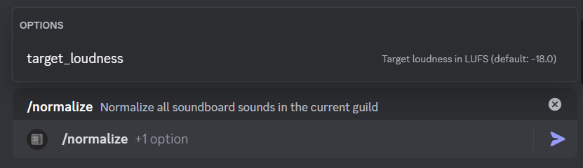
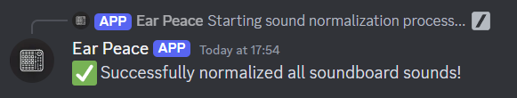

# Earpeace 🎚️

A tool that automatically normalizes the volume of audio clips. Available as both a CLI tool and a Discord bot.

[](https://discord.com/oauth2/authorize?client_id=1312227542652026880)

## Features

- 🔊 Automatically normalizes audio clips to consistent volume levels
- 🎯 Works with Discord soundboards or local audio files
- ⚡ Low latency processing
- 🛠️ Available as both a CLI tool and Discord bot
- 📊 Configurable target loudness and peak ceiling
- 🔄 Supports multiple audio formats (mp3, wav, ogg)

## Why?

Audio clips often have inconsistent volume levels, which can be jarring when played back. Earpeace ensures all clips are normalized to a comfortable, consistent volume level - no more unexpectedly loud sounds!

## Discord Bot

The Discord bot version automatically normalizes soundboard clips in your server.

### Bot Commands
- `/normalize [target-loudness]` - Normalize all soundboard clips (optional target loudness)




## CLI Tool

The command-line version lets you normalize local audio files or Discord soundboard clips.

### Installation
```bash
cargo install earpeace
```

### CLI Usage Examples
```bash
# Normalize local audio files
earpeace normalize --input-dir ./clips

# List Discord soundboard clips
earpeace --discord-token "your_token" --guild-id "your_guild" ls

# Normalize Discord soundboard clips
earpeace --discord-token "your_token" --guild-id "your_guild" normalize

# Customize normalization settings
earpeace normalize --target-loudness "-16.0" --peak-ceiling "-3.0"
```

### CLI Options
```bash
earpeace [OPTIONS] <COMMAND>

Commands:
  normalize    Normalize audio files
  ls          List Discord soundboard sounds
  cp          Copy sounds from Discord to local directory
  help        Print help

Options:
  -t, --target-loudness <TARGET_LOUDNESS>
          Target loudness in LUFS (default: -18)
  -p, --peak-ceiling <PEAK_CEILING>
          Target peak output in dB (default: -1)
  -i, --input-dir <INPUT_DIR>
          Directory containing local audio files to normalize
  -d, --discord-token <DISCORD_TOKEN>
          Discord bot token with permissions to read the soundboard
  -g, --guild-id <GUILD_ID>
          Discord guild ID to normalize sounds from
  -l, --log-level <LOG_LEVEL>
          Log level (default: info)
  -h, --help
          Print help
```

## Configuration

Both the CLI tool and Discord bot use these default settings:

- Target Loudness: -18 LUFS
- Peak Ceiling: -1 dB
- Log Level: info

For the CLI tool, these can be configured via command-line flags or environment variables in a `.env` file:
```
DISCORD_TOKEN=your_token_here
GUILD_ID=your_guild_id
```